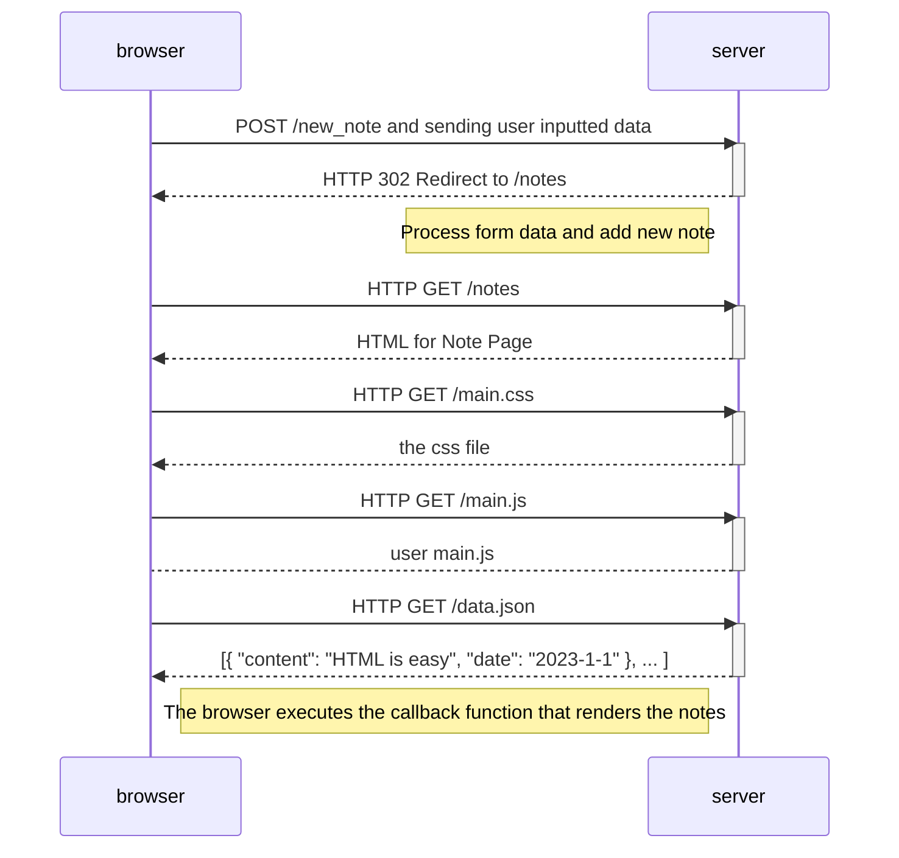
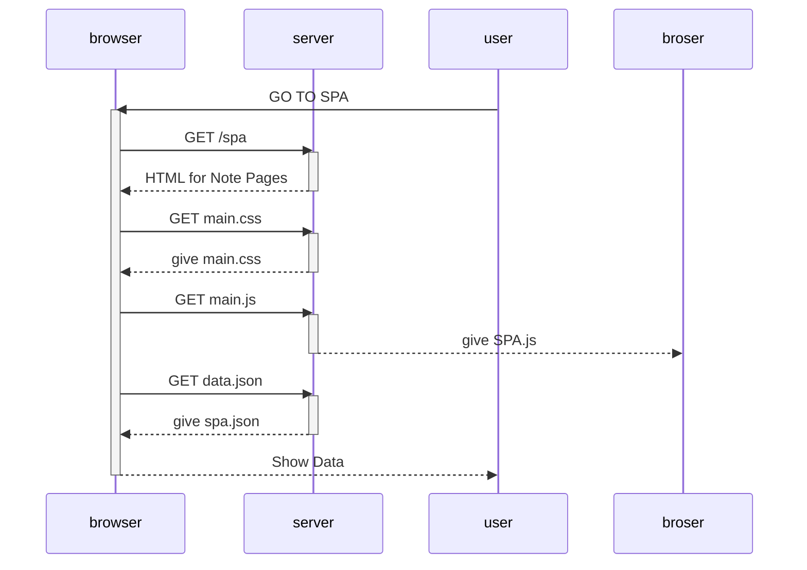

# Sequence Diagram

## user creates a new note

```mermaid
sequenceDiagram
participant browser
participant server

    browser->>server: POST /new_note and sending user inputted data
    activate server
    server-->>browser: HTTP 302 Redirect to /notes
    deactivate server

    Note left of server: Process form data and add new note

    browser->>server: HTTP GET /notes
    activate server
    server-->>browser: HTML for Note Page
    deactivate server

    browser->>server: HTTP GET /main.css
    activate server
    server-->>browser: the css file
    deactivate server

    browser->>server: HTTP GET /main.js
    activate server
    server -->browser: user main.js
    deactivate server

    browser->>server: HTTP GET /data.json
    activate server
    server-->>browser: [{ "content": "HTML is easy", "date": "2023-1-1" }, ... ]
    deactivate server

    Note right of browser: The browser executes the callback function that renders the notes
```

## Single page app diagram

```mermaid
sequenceDiagram
participant browser
participant server
participant user

    user->>browser: GO TO SPA
    activate browser

    browser->>server: GET /spa
    activate server
    server-->>browser:HTML for Note Pages
    deactivate server

    browser->>server: GET main.css
    activate server
    server-->>browser:give main.css
    deactivate server

    browser->>server: GET main.js
    activate server
    server-->>broser:give SPA.js
    deactivate server

    browser->>server: GET data.json
    activate server
    server-->>browser: give spa.json
    deactivate server

    browser-->>user: Show Data
    deactivate browser

```

## New note in Single page app diagram
